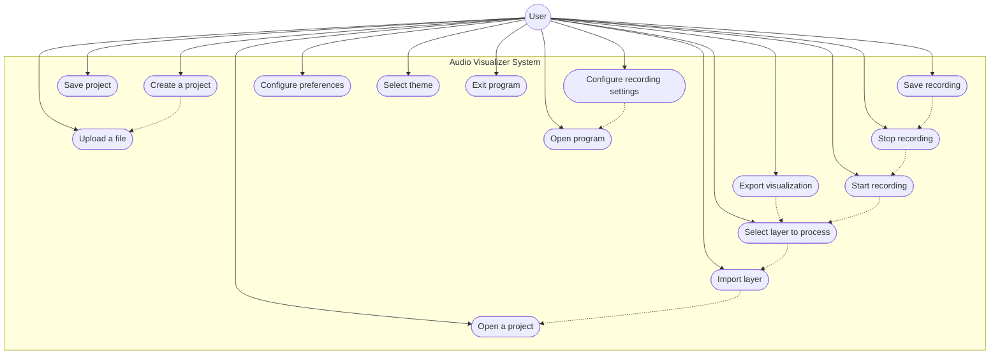

```mermaid
flowchart TD
    %% Define the actor
    User((User))
    
    %% Define the system boundary
    subgraph AudioVisualizerSystem["Audio Visualizer System"]
        %% File Management Use Cases
        CreateProject(["Create a project"])
        OpenProject(["Open a project"])
        SaveProject(["Save project"])
        UploadFile(["Upload a file"])
        
        %% Visualization Use Cases
        ImportLayer(["Import layer"])
        SelectLayer(["Select layer to process"])
        ExportVisualization(["Export visualization"])
        
        %% Recording Use Cases
        StartRecording(["Start recording"])
        StopRecording(["Stop recording"])
        SaveRecording(["Save recording"])
        ConfigureRecording(["Configure recording settings"])
        
        %% Settings Use Cases
        ConfigurePreferences(["Configure preferences"])
        SelectTheme(["Select theme"])
        
        %% Program Control Use Cases
        OpenProgram(["Open program"])
        ExitProgram(["Exit program"])
    end
    
    %% Define relationships
    User --> OpenProgram
    User --> CreateProject
    User --> OpenProject
    User --> SaveProject
    User --> UploadFile
    User --> ImportLayer
    User --> SelectLayer
    User --> ExportVisualization
    User --> StartRecording
    User --> StopRecording
    User --> SaveRecording
    User --> ConfigureRecording
    User --> ConfigurePreferences
    User --> SelectTheme
    User --> ExitProgram
    
    %% Define dependencies
    CreateProject -.-> UploadFile
    ImportLayer -.-> OpenProject
    SelectLayer -.-> ImportLayer
    ExportVisualization -.-> SelectLayer
    StartRecording -.-> SelectLayer
    StopRecording -.-> StartRecording
    SaveRecording -.-> StopRecording
    ConfigureRecording -.-> OpenProgram
```

